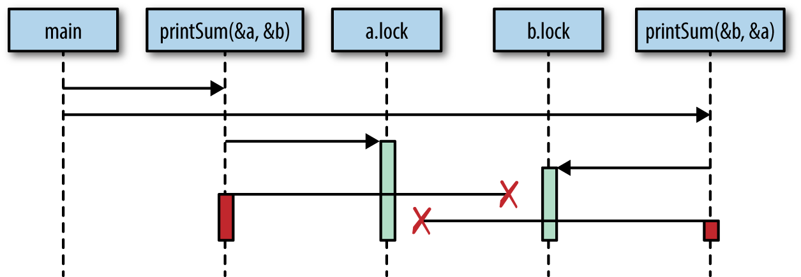

## Race Conditions
A race condition occurs when two or more operations must `excecute` in the correct order. But the program has not been 
written so that this order is guaranteed to be maintained.

> Most of the time, this shows up in what's called a data race, where one concurrent operation attempts to read a variable,
> while at some undetermined time another concurrent operation is attempting to write to the same variable.

Example:
```go
var count int64
go func() {
	count++
}
if count == 0 {
	fmt.Printf("Count is reached %v!", count)
}
// There are more than one output to running this code
// The result is: `Count is reached 0`
// Or: Count is reached 1
// Or: nothing are printed
=> This code is not run sequentially.
```
# Atomicity
> When something is considered atomic or to have the property of atomicity, this means 
> that within(inside something) the context that it is operating, it is invisible(unable to be divided or separated)
> or uninterruptible(not able to be broken in continuity).

## What is `context`?
Something maybe atomic in one context, but not another.
Operations that are atomic within the context of your process may not be atomic in the context of the operating system. 
In other words, the atomicity of an operation can change depending on the currently defined scope.

When thinking about atomicity, very often the first thing you need to do is to define the context, or scope, the operation
will be considered to be atomic in.


# Memory Access Synchronization
```go
var memoryAcsess sync.Mutex
var value int
go func() {
	memoryAccess.Lock()
	value++
	memoryAccess.Unlock()
}

memoryaccess.Lock()
if value == 0 {
	fmt.Printf("The value is %v", value)
} else {
	fmt.Printf("The value is %v", value)
}
memoryaccess.Unlock()
```
* In this example, we've created a convention for developers to follow. Anytime developers
want to access the `data` variable's memory, they must first call `Lock`, and
when they're finished they must call `Unlock`.
* Synchronizing access the memory also shares some problems with other techniques of modeling concurrent problems.

# Deadlocks
## Deadlock
A deadlocked program is one in which all concurrent processes are waiting on one another. In this state, the program will
never recover without outside intervention.
```go
type value struct {
	mu sync.Mutex
	value int
}

var wg sync.WaitGroup
printSum := func(v1, v2 *value) {
	defer wg.Done()
	v1.mu.Lock()
	defer v1.mu.Unlock()
	
	time.Sleep(2 * time.Second)
	v2.mu.Lock()
	defer v2.mu.Unlock()
	
	fmt.Printf("sum = %v", v1.value + v2.value)
}

var a, b value
wg.Add(2)
go printSum(&a, &b)
go printSum(&b, &a)
wg.Wait()
```
This image below demonstrate how the deadlock occurs


